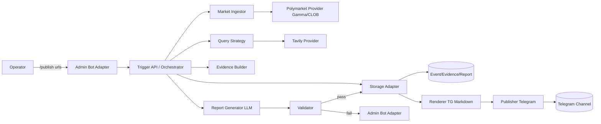
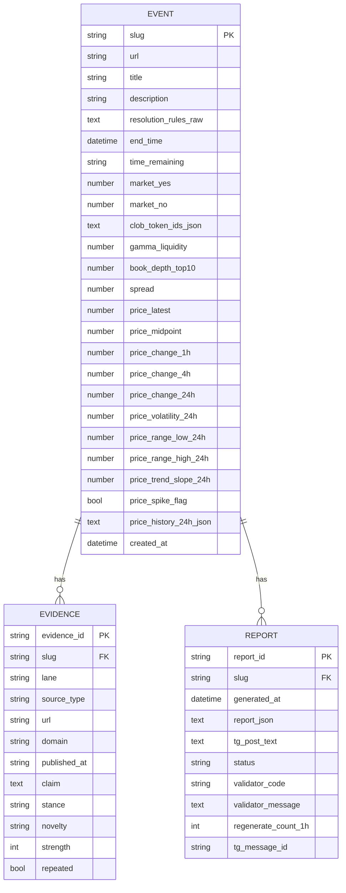
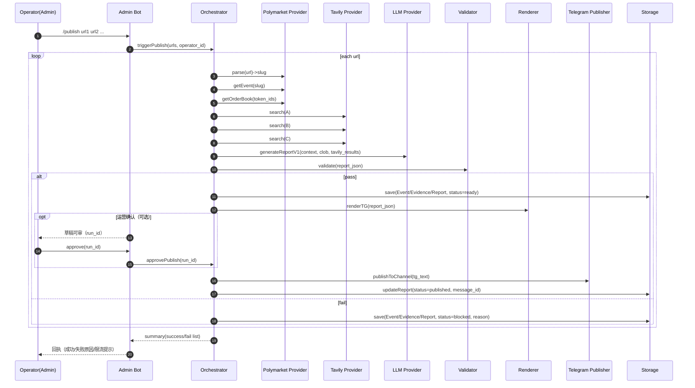

# AI 预测信号聚合器（MVP）技术架构文档 TDD v0.2（聚焦 Week 1 交互闭环 + 可扩展性）

**对应 PRD**：PRD v0.2（BMAD）
**日期**：2026-01-23（UTC）
**目标**：用最小系统完成“运营触发 → 生成 Report v1 → 三表落地 → 推送 TG Channel（可选运营校验）”的端到端交互；同时为后续接入更多平台/数据源/前端形态留好扩展点。

---

## 1. 交互闭环定义（Week 1 的“完成交互”）

### 1.1 参与者（Actors）

- **运营（Operator）**：触发生成/发布、查看失败原因、在限流允许范围内重试。
- **系统（Pipeline）**：自动拉取市场数据、检索外部资讯、生成报告、校验、落库、发布（可选运营校验）。
- **Telegram Channel（读者）**：最终报告消费端。

### 1.2 核心交互（必须跑通）

> 运营输入任意数量 Polymarket 链接（不限制 5 条）→ 系统生成对应报告 → Validator 通过后先落地 →（可选运营校验）→ 推送 TG Channel → 返回执行结果（成功/失败原因）。

### 1.3 运营触发入口（推荐方案）

为了 Week 1 快速落地，同时避免额外 Web 后台开发，采用 **“Admin Bot 命令触发 + 同一套内部 Trigger API”**：

- 运营在 Telegram 私聊 Bot（或运营群）发送命令：
  - `/publish <url1> <url2> ...`
  - `/regen <polymarket_slug>`
  - `/status <polymarket_slug>`
- Bot 仅允许白名单 `admin_user_ids` 触发（配置化）
- Bot 调用内部 Trigger API（HTTP 或本进程方法调用）执行流水线
- 成功后，Bot 将已落地的报告按发布策略推送到 **指定 Channel chat_id**

> 可替代入口（同一套 Trigger API 复用）：CLI / 最小 Web Form（Week 2+）

---

## 2. 系统总体架构（可扩展的“管道式”设计）

### 2.1 架构原则

- **管道化（Pipeline）**：每一步输入/输出结构化；失败可定位、可重试、可插拔。
- **强约束输出**：LLM 只产出 Report v1 JSON；渲染由代码完成（避免二次幻觉）。
- **质量闸门**：Validator 不通过 → 禁止发布，但仍落地记录。
- **Provider/Adapter 分层**：平台、搜索、发布、存储、LLM 都以接口抽象。

### 2.2 逻辑组件图（Mermaid）



### 2.3 运行形态（Week 1 推荐）

- 单一服务进程（Node.js/TS）包含：
  - Admin Bot Adapter（监听消息）
  - Orchestrator（流水线执行）
  - Provider（Polymarket/Tavily/LLM/Telegram）
  - Storage（SQLite 本地 + 可选导出 Sheet/Notion）
- 这样最少部署复杂度；后续再拆分成 worker/queue 也不影响接口。

---

## 3. 模块分解与接口（面向扩展）

> 关键：把“变化最大的外部依赖”都放在 Provider/Adapter 层，核心流水线只吃标准化数据结构。

### 3.1 Provider 接口清单（概览）

> Week 1 强调“交互闭环”，但外部依赖最容易变化，所以 Provider 必须“接口先行 + 实现可替换”。
> **本节只给概览**，每个 Provider 的**可落地实现细节**（端点、鉴权、参数、返回、限流、失败语义、缓存策略、示例请求）统一放在文末 **附录 A–J**。

1) `MarketProvider`（Week 1：Polymarket）

- `parseEventUrl(url) -> {slug}`
- `getEvent(slug) -> MarketContext`
- `listMarketsByEvent(eventId) -> Market[]`（可选：用于多市场事件）
- `getOrderBookSummary(tokenId) -> OrderBookSummary`
- `getMarketOdds(marketId|tokenId) -> {yes,no}`（优先从 Gamma Market outcomePrices；必要时用 CLOB Pricing）

2) `PricingProvider`（Week 1：Polymarket Pricing API）

- `getMarketPrice(tokenId) -> latest_price`
- `getMidpointPrice(tokenId) -> midpoint_price`
- `getPriceHistory(tokenId, window) -> PricePoint[]`

3) `SearchProvider`（Week 1：Tavily）

- `search(query, options) -> SearchResults`
- `batchSearch(queries[], options) -> SearchResults[]`（可选：做 lane 并发）
- 新闻上下文可替换 NewsData/Perigon 作为 News Provider，减少 Tavily 消耗

4) `SentimentProvider`（Week 2+ 可开）

- `getSentiment(query, window) -> SentimentSnapshot`
- Week 1 默认关闭（见附录 G/H：NewsData / Perigon 方案对比与接口占位）

5) `LLMProvider`

- `generateReportV1(input) -> ReportV1Json`（强制结构化 JSON 输出）
- `summarizeEvidence(input) -> EvidenceDigest`（可选）

6) `Publisher`

- `publishToChannel(text, options) -> {message_id}`
- `editMessage(message_id, text) -> ...`（可选）
- Week 1：`TelegramPublisher`

7) `StorageAdapter`

- `upsertEvent(event)`
- `appendEvidence(evidence[])`
- `saveReport(report)`
- `getLatestReport(slug)`（用于 /status）
- Week 1 最小实现：`SQLiteStorage`；可选：`SheetStorage`/`NotionStorage`（见附录 F）

### 3.2 核心数据结构（内部标准化 DTO）

- `MarketContext`（来自 Gamma）
  - title, url, description, resolution_rules_raw, end_time, market_odds_yes/no, clob_token_ids, liquidity_proxy, price_context
- `ClobSnapshot`（来自 CLOB）
  - spread, midpoint, book_top_levels, notable_walls, price_change_24h
- `PriceContext`（来自 Pricing + 代码派生）
  - latest_price, midpoint_price
  - history_24h[{ts, price}]
  - signals{change_1h, change_4h, change_24h, volatility_24h, range_high_24h, range_low_24h, trend_slope_24h, spike_flag}
  - 计算口径见附录 J
- `TavilyLaneResult`
  - lane(A/B/C/D), query, results[{title,url,domain,published_at,raw_content}]
- `EvidenceCandidate`
  - source_type, url, domain, published_at, claim, stance, novelty, repeated, strength
- `ReportV1Json`（严格匹配 schema）
- `TelegramPost`
  - tg_text, parse_mode, disable_preview, tags（可选）

---

## 4. 端到端流水线设计（含“补搜”与限流）

### 4.1 主流程（单事件）

1) URL → slug
2) 拉取 Gamma Event → `MarketContext`（必须拿到 resolution_rules_raw）
3) 拉取 CLOB Book → `ClobSnapshot`
4) 拉取 Pricing（最新价/中位价/历史）→ 计算价格派生指标 → 合并到 `MarketContext.price_context`
5) QueryStrategy 生成 A/B/C；D 满足条件时生成 2–3 类查询
6) Tavily 多车道检索（默认 A/B/C；D 条件触发且执行 2–3 类 Query）
7) EvidenceBuilder 去重、打标、产出 evidence_candidates
8) LLMProvider 生成 Report v1 JSON
9) Validator 校验（schema + 内容闸门）
10) 若通过：StorageAdapter 落地三表（Event/Evidence/Report，status=ready）
11) Renderer 生成 TG 文案并回写存储
12) 按发布策略自动推送或等待运营确认；发布后更新 status/message_id
13) 返回执行结果（成功/失败原因）

### 4.2 多事件批处理（运营一次输入多个链接）

- 入口：`/publish url1 url2 ...`
- Orchestrator：
  - 先对 URLs 去重/校验
  - 并发执行（建议并发=2~3，配置化）
  - 每条独立产出 success/fail
- Bot 回执：
  - 汇总列表：成功 X 条（附 message link 或 id），失败 Y 条（附 error code）

### 4.3 “补搜”策略（节省额度 + 提升通过率）

触发补搜条件（与 PRD 一致）：

- 赔率 24h 大幅波动（阈值配置化）
- 事件为“社交驱动”（加密/政治争议）
- `disagreement_map` 任一侧证据不足（<2）
- `failure_modes` 泛泛（observable_signals 太短/空）
- 引用 URL < 4 或域名过于单一

补搜规则：

- 优先补 C（Counter）一次（或将 C 从 basic→advanced）
- 满足 D 条件时，启用 D 查询组（必须执行 2–3 类不同类型 Query）
- 超出 Tavily 限额 → 直接失败并返回“证据不足/额度限制”原因

---

## 5. Validator 设计（质量闸门 = 发布前最后一道防线）

### 5.1 两层校验

1) **Schema 校验**

- 严格按 `report_v1.schema.json` 校验（建议用 AJV）
- 概率字段统一 0–100

2) **内容闸门**

- 必填：resolution_rules_raw 不空
- 双边：pro/con 各 ≥ 2
- 失败路径：≥ 2 且必须包含 observable_signals
- 来源：URL ≥ 4、域名多样性
- 反喊单：命中黑名单词直接阻断
- sentiment：无样本则 bias/relation=unknown

### 5.2 输出错误格式（用于运营可读回执）

```
> **Mermaid 兼容性提示**：部分渲染器（例如旧版 mermaid 8.x）对“智能引号/Unicode 标点”很敏感。请避免使用 `’` 这类字符作为节点名；同时确保每条边是**独立一行**（不要被编辑器压成同一行），否则可能出现解析错误。
json
{
  "ok": false,
  "code": "INSUFFICIENT_EVIDENCE",
  "message": "反方证据不足：con<2；建议补搜 C 车道或启用 D 查询组",
  "suggestion": { "action": "ADD_SEARCH", "preferred_lane": "C" }
}
```

---

## 6. 渲染与发布（稳定输出 > 文风）

### 6.1 Renderer（从 JSON 到 TG 文案）

- Renderer 只做字符串模板渲染（PRD 附录 C）
- 保留结构层级与标题编号，保证读者形成阅读习惯
- resolution_rules_raw 过长：截断并提示“以市场页原文为准”

### 6.2 TelegramPublisher（落地后/可审核）

- Channel chat_id 配置化
- parse_mode 配置化（Markdown/MarkdownV2/HTML）
- 默认 disable_web_page_preview=true
- 支持自动发布或运营确认后发布
- 发布成功返回 message_id（可用于审计/追踪）

---

## 7. 存储与“可复盘性”（Week 1 轻量 + 可升级）

### 7.1 Week 1 推荐：SQLite 作为系统真相源（最少依赖）

原因：

- 需要做 **限流计数、缓存索引、报告回查、失败记录**；Sheet/Notion 更适合作为“可读导出”，不适合作为强一致系统状态。

建议：

- SQLite：保存 Event/Evidence/Report + rate_limit + cache
- 可选：Exporter 把三表同步到 Sheet/Notion（运营可视化）

### 7.2 数据表（SQLite 逻辑模型）



> 若你们坚持 Week 1 “只用 Sheet/Notion”，也可以：SQLite 只保留 rate_limit/cache/status，三表写入 Sheet/Notion。

---

## 8. 限流与缓存（满足 PRD v0.2）

### 8.1 重复生成限流（per event）

- 5 分钟内最多 1 次
- 1 小时最多 5 次
- 策略：基于 `slug` + 时间窗计数（SQLite/Redis均可）

### 8.2 Tavily 全局速率

- qps/burst 配置化
- 实现：token bucket（进程内即可；多实例时用 Redis）

### 8.3 缓存键策略（与 PRD 附录 A 一致）

- `event_slug + day + lane + query_hash`
- TTL：1 天
- 作用：同日同事件多次生成避免重复消耗 Tavily 额度

---

## 9. 安全与合规（Week 1 必须做到的“底线”）

- **Admin 白名单**：只有配置中允许的 user_id 能触发 /publish /regen
- **密钥管理**：Tavily/TG/LLM key 仅从 env 或 secrets 注入，禁止写入 repo
- **防喊单**：Validator 黑名单 + 免责声明固定渲染
- **审计**：每次发布记录：who触发、何时、event slug、message_id、validator结果

---

## 10. 可观测性（用最少代价做到可排障）

### 10.1 结构化日志（建议 JSON log）

关键字段：

- request_id（每次 publish 批次）
- slug
- step（gamma_fetch / tavily_A / llm_generate / validate / publish）
- latency_ms
- error_code/error_message
- tavily_calls_count / cache_hit

### 10.2 指标（可先日志聚合，后续上 Prometheus）

- validator_pass_rate
- avg_latency_per_event
- tavily_calls_per_event
- publish_success_rate

---

## 11. 部署拓扑（Week 1 最小化）

- 单服务：`ai-signal-bot`
  - Node.js 18+/20 + TypeScript
  - 运行方式：Docker / PM2 / systemd（任选一种）
- 存储：SQLite 文件挂载持久化
- 可选：S3/对象存储备份 report_json

---

## 12. 扩展性设计（为 Phase 2/3 留“插槽”）

### 12.1 平台扩展（Polymarket → Kalshi/其他）

- 新增 `KalshiProvider implements MarketProvider`
- 不改 Orchestrator，只在配置中切换 provider

### 12.2 数据源扩展（Tavily → Exa / 专业数据源）

- `SearchProvider` 抽象已隔离
- QueryStrategy 可按 domain/topic 插策略（政治/体育/加密不同 query 模板）

### 12.3 发布渠道扩展（TG → Discord/Email/Web）

- `Publisher` 抽象
- 渲染层可输出多格式：TG Markdown / Web HTML / PDF（后续）

### 12.4 任务系统扩展（同步 → 队列/worker）

- 当前 Orchestrator 同步执行
- 后续可加 `JobQueue`：
  - API 接收任务 → 入队 → worker 执行 → 回写状态 → bot 通知

### 12.5 个性化与用户系统（Phase 2+）

- 未来增加 User/Profile，不影响 Week 1 的 report 生成核心
- Report 可增加 `audience` 字段（public/internal/beta）

---

## 13. Week 1 工程拆解（按可交付物）

### 13.1 必做清单（最小可运行）

1) Admin Bot：解析命令、白名单、回执
2) Orchestrator：单事件 + 多事件并发
3) PolymarketProvider：Gamma + CLOB
4) TavilyProvider：多车道调用 + 缓存 + 限流
5) EvidenceBuilder：去重/打标（简版）
6) LLMProvider：按 Report v1 prompt 生成 JSON
7) Validator：AJV + 内容闸门 + 反喊单
8) Renderer：固定模板
9) Storage：SQLite（含 rate_limit/cache/status）
10) TelegramPublisher：落地后/审核后发布到 channel

### 13.2 验收用例（建议）

- 用 PRD 示例市场链接跑通：生成成功并在 Channel 可见
- 构造“证据不足”场景：Validator 阻断并返回原因，补搜后可通过
- 触发限流：5 分钟内重复 /regen 被拒绝
- Tavily 缓存命中：同日同 query 不再调用 Tavily

---

## 14. 附：关键配置（与 PRD 对齐）

- `telegram.channel_chat_id`
- `rate_limit.regenerate.min_interval_seconds = 300`
- `rate_limit.regenerate.per_hour.max_requests = 5`
- `tavily.lanes.A/B/C/D` 默认参数（A/B basic，C 可 advanced）

---


## 15. Provider 详细实现与接口清单（拆分文档）

- 附录 A：PolymarketProvider（Gamma API）——事件/市场元数据与赔率 `docs/architecture/providers/polymarket-gamma.md`
- 附录 B：PolymarketProvider（CLOB API）——订单簿（Market Data）`docs/architecture/providers/polymarket-clob.md`
- 附录 C：TavilyProvider ——资讯检索（结构化上下文）`docs/architecture/providers/tavily.md`
- 附录 D：TelegramPublisher ——落地后推送 TG Channel `docs/architecture/providers/telegram.md`
- 附录 E：LLMProvider ——结构化报告生成（Report v1）`docs/architecture/providers/llm.md`
- 附录 F：StorageAdapter ——Week 1 用 SQLite，预留 Notion/Sheet `docs/architecture/providers/storage.md`
- 附录 G：SentimentProvider 方案 1 ——NewsData.io `docs/architecture/providers/sentiment-newsdata.md`
- 附录 H：SentimentProvider 方案 2 ——Perigon `docs/architecture/providers/sentiment-perigon.md`
- 附录 I：Provider 通用实现规范 `docs/architecture/providers/provider-guidelines.md`
- 附录 J：Polymarket Pricing API ——token 价格数据 `docs/architecture/providers/polymarket-pricing.md`

## 16. Appendix：关键交互时序图（运营触发 /publish）


